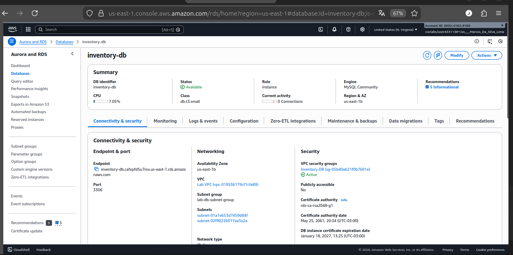
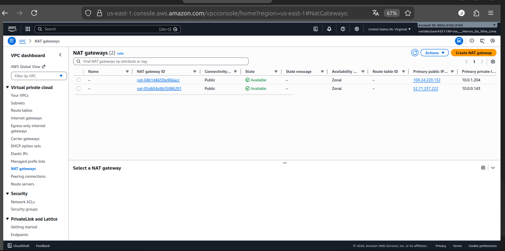
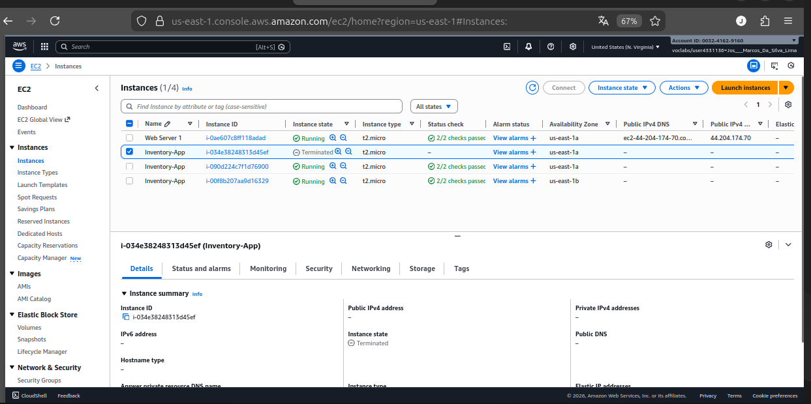
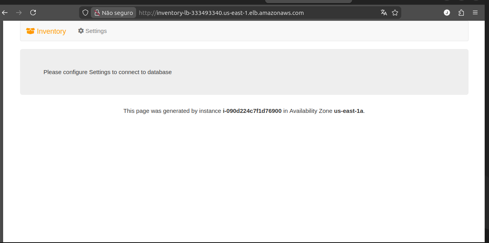

# Lab: Arquitetura de Alta Disponibilidade e Tolerância a Falhas na AWS

Implementação de uma infraestrutura web robusta de 3 camadas (Web, App, Data), projetada para resistir a falhas de Zona de Disponibilidade (AZ) e escalar automaticamente.

## 🎯 Objetivos Realizados
- **VPC & Rede:** Configuração de VPC com sub-redes Públicas e Privadas em múltiplas AZs.
- **Compute:** Implementação de Auto Scaling Group para garantir disponibilidade mínima da aplicação.
- **Traffic Management:** Uso de Application Load Balancer (ALB) para distribuição de carga e health checks.
- **Security:** Configuração de Security Groups em camadas (Load Balancer -> App -> DB).

## 🚀 Diferenciais Implementados (Advanced)
Além do escopo básico do laboratório, implementei recursos críticos para ambientes de produção:

### 1. Banco de Dados Multi-AZ (RDS)
Configurei a instância RDS MySQL para **Multi-AZ Deployment**.
* **Resultado:** O banco possui uma réplica síncrona em outra zona. Em caso de falha física no data center primário, o failover ocorre automaticamente sem perda de dados.

### 2. NAT Gateway Altamente Disponível
A arquitetura padrão possuía um ponto único de falha na saída para a internet.
* **Solução:** Provisionei um segundo NAT Gateway na segunda Zona de Disponibilidade e configurei tabelas de rotas independentes. Agora, a conectividade das sub-redes privadas é redundante.

---

## 📸 Evidências de Resiliência

### Auto Scaling e Self-Healing
Teste de caos realizado: Ao terminar manualmente uma instância EC2, o Auto Scaling detectou a falha de saúde e provisionou automaticamente um novo servidor para manter a capacidade desejada.

### Load Balancing em Ação
A aplicação distribui o tráfego ativamente entre diferentes Zonas de Disponibilidade (us-east-1a / us-east-1b).

---

## 🛠 Tecnologias
* AWS EC2 & Auto Scaling
* Application Load Balancer (ALB)
* Amazon RDS (Multi-AZ)
* VPC, NAT Gateway & Security Groups
* Linux & Apache Web Server
