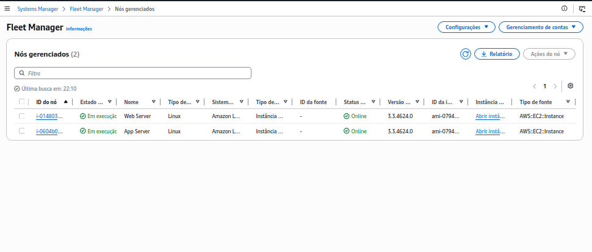

# Lab 02 — Auditoria de recursos AWS com Systems Manager e AWS Config

> Laboratório prático de Cloud Operations focado em gerenciamento, inventário e auditoria de recursos AWS.

## 🎯 Objetivo

Praticar o uso do **AWS Systems Manager** e do **AWS Config** para aumentar a visibilidade sobre instâncias Amazon EC2, realizar gerenciamento seguro e estabelecer verificações de conformidade.

Neste laboratório foram trabalhados conceitos de:

- Inventário do AWS Systems Manager;
- Fleet Manager e nós gerenciados;
- Session Manager para acesso às instâncias sem depender de SSH;
- configuração e gravação de recursos com AWS Config;
- regras do AWS Config para auditoria de conformidade;
- consulta de informações de inventário das instâncias gerenciadas.

## 🛠️ Serviços AWS utilizados

| Serviço | Finalidade no laboratório |
|---|---|
| **AWS Systems Manager** | Gerenciamento centralizado e inventário das instâncias EC2. |
| **Fleet Manager** | Visualização e gerenciamento dos nós gerenciados. |
| **Session Manager** | Acesso ao terminal de instâncias EC2 sem necessidade de abrir SSH. |
| **AWS Config** | Registro das configurações e avaliação de conformidade dos recursos. |
| **Amazon EC2** | Infraestrutura computacional utilizada pelo ambiente do laboratório. |

## 🏗️ Ambiente

O ambiente fornecido pelo laboratório continha duas instâncias EC2, identificadas no Fleet Manager como **Web Server** e **App Server**. As duas apareceram como nós gerenciados e online no AWS Systems Manager.

## 🚀 Atividades realizadas

### 1. Configuração do inventário do Systems Manager

O inventário foi configurado para coletar informações das instâncias EC2 selecionadas. O objetivo é centralizar metadados do ambiente computacional, permitindo maior visibilidade sobre sistemas, aplicações e configurações.

### 2. Validação dos nós gerenciados

No **Fleet Manager**, as duas instâncias do laboratório foram identificadas como nós gerenciados e apresentaram status **Online**.

> **Evidência:** a captura demonstra que os dois nós EC2 estão disponíveis para gerenciamento pelo AWS Systems Manager.

### 3. Acesso seguro com Session Manager

Foi utilizado o recurso de sessão do Systems Manager para acessar uma instância EC2 por meio do console, sem a necessidade de estabelecer uma conexão SSH tradicional.

Durante a atividade, foi realizada uma verificação no terminal da instância e consultadas informações das instâncias EC2 disponíveis no ambiente.

### 4. Configuração do AWS Config

O AWS Config foi habilitado para registrar continuamente as configurações dos recursos do ambiente. Essa etapa estabelece a base para auditoria e avaliação de conformidade.

### 5. Criação de regras de conformidade

Foram configuradas regras gerenciadas pelo AWS Config para verificar aspectos específicos do ambiente:

- **ec2-instance-managed-by-systems-manager** — verifica se as instâncias EC2 estão sendo gerenciadas pelo Systems Manager;
- **iam-user-no-policies-check** — verifica usuários do IAM em relação à existência de políticas em linha.

Essas regras demonstram como o AWS Config pode ser utilizado para identificar desvios de configuração e pontos que precisam ser avaliados pela equipe de operações.

### 6. Exploração do inventário

Por fim, foi explorado o inventário coletado pelo Systems Manager para visualizar informações das instâncias gerenciadas, incluindo dados de aplicações, configuração e informações operacionais disponíveis no ambiente.

## 📸 Evidências

### AWS Systems Manager — Fleet Manager

A captura abaixo mostra os dois nós gerenciados do laboratório com status **Online**.

### Evidências adicionais

As demais capturas poderão ser adicionadas manualmente conforme a documentação das etapas:

- `02-systems-manager.png`
- `03-systems-manager.png`

## 🔍 Resultados

O laboratório permitiu praticar um fluxo básico de **Cloud Operations** envolvendo visibilidade, gerenciamento e auditoria de recursos:

1. identificação de instâncias EC2 como nós gerenciados;
2. uso do Systems Manager para gerenciamento centralizado;
3. acesso por Session Manager sem depender de SSH;
4. configuração do AWS Config para registrar configurações;
5. criação de regras para verificar conformidade;
6. consulta do inventário das instâncias gerenciadas.

A evidência disponível neste repositório comprova a presença de **dois nós gerenciados e online no Fleet Manager**. As demais evidências devem ser consideradas somente quando as respectivas capturas forem adicionadas.

## 🧠 Principais aprendizados

- O **Systems Manager** pode centralizar operações sobre uma frota de instâncias EC2.
- O **Fleet Manager** fornece uma visão dos nós gerenciados e seus estados.
- O **Session Manager** permite acesso administrativo sem a necessidade de expor a porta SSH 22.
- O **AWS Config** mantém registros das configurações dos recursos e permite avaliações de conformidade.
- Regras do AWS Config podem ser utilizadas para identificar desvios relacionados à gestão e segurança dos recursos.
- Inventário e auditoria fornecem informações importantes para operações, troubleshooting e governança da infraestrutura.

## 💼 Aplicação profissional

Esse conhecimento pode ser aplicado em funções de **Cloud Support, Cloud Operations, AWS Administrator e SysOps**, especialmente em atividades de inventário, gerenciamento de servidores, auditoria de configuração e identificação de não conformidades.

Em ambientes maiores, a combinação entre Systems Manager e AWS Config pode ajudar equipes de operações a manter visibilidade sobre uma frota de recursos e detectar desvios de configuração de forma contínua.

## ⚠️ Observações e limitações

Durante a execução, algumas informações do AWS Config podem levar alguns minutos para aparecer ou sincronizar com o Systems Manager. Por isso, nem todas as evidências visuais precisam estar disponíveis imediatamente após uma etapa.

Este repositório documenta a execução prática e o aprendizado do laboratório; ele não representa uma implementação de produção.

## 🧹 Limpeza do ambiente

Após concluir o laboratório, os recursos temporários devem ser encerrados conforme as orientações do ambiente de treinamento, especialmente recursos que possam gerar cobrança fora do período de utilização.

## 📚 Referências

- [AWS Systems Manager](https://aws.amazon.com/systems-manager/)
- [AWS Config](https://aws.amazon.com/config/)
- [Amazon EC2](https://aws.amazon.com/ec2/)

---

**Categoria:** Cloud Operations / AWS / SysOps  
**Nível:** Fundamental / Intermediário inicial  
**Tipo:** Hands-on Lab
