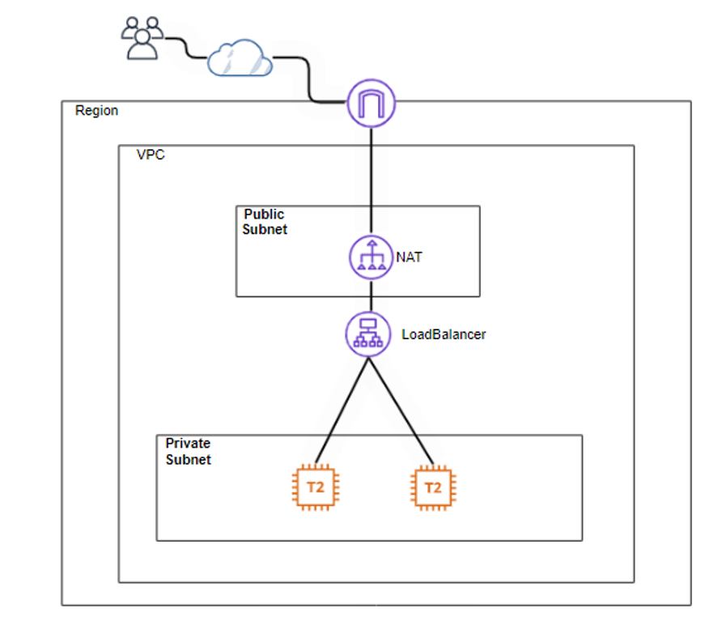

# ☁️ Projeto AWS: Infraestrutura de Alta Disponibilidade e Segurança com VPC & Application Load Balancer

> **Status:** ✅ Projeto Concluído e Validado
> **Nível:** Intermediário / Avançado
> **Stack:** AWS VPC, EC2 (Amazon Linux 2023), ALB, NAT Gateway, Security Groups, IAM.

## 🎯 Objetivo do Projeto

O objetivo principal deste laboratório foi projetar e implementar uma arquitetura de rede na AWS focada em **segurança** e **alta disponibilidade**.

O desafio era isolar completamente a camada de aplicação (servidores EC2) da internet pública, garantindo que elas só pudessem ser acessadas através de um ponto de entrada único e controlado: um **Application Load Balancer (ALB)**. Esta é uma arquitetura padrão de mercado para proteger aplicações web contra acessos diretos não autorizados.

---

## 🏗️ Arquitetura e Topologia de Rede

A solução foi construída seguindo os pilares do **AWS Well-Architected Framework**, utilizando uma abordagem Multi-AZ (Múltiplas Zonas de Disponibilidade) para garantir tolerância a falhas. Se um data center da AWS (`us-west-2a`) cair, o tráfego é automaticamente redirecionado para o outro (`us-west-2b`).

### 🧠 O Conceito (Diagrama Lógico)
A imagem abaixo ilustra o fluxo de dados planejado. O usuário acessa o ALB na camada pública, que então distribui a carga para as instâncias protegidas na camada privada.


*Figura 1: Diagrama da topologia de rede implementada, mostrando a separação entre subnets públicas e privadas.*

### ⚙️ A Implementação Real (VPC Resource Map)
Após a configuração, a própria AWS gera um mapa dos recursos criados. Este mapa confirma que as Tabelas de Roteamento (Route Tables) foram configuradas corretamente para isolar as subnets privadas.


*Figura 2: Visualização do AWS Console confirmando a associação correta entre Subnets e Route Tables.*

#### Detalhamento dos Componentes:

| Componente | Função na Arquitetura | Tipo de Subnet |
| :--- | :--- | :--- |
| **VPC Customizada** | Rede virtual isolada criada do zero (CIDR `10.0.0.0/16`) para não depender da VPC padrão. | N/A |
| **Internet Gateway (IGW)** | Porta de saída para a internet. Associado apenas à Tabela de Rotas Pública. | Pública |
| **NAT Gateway** | Permite que as instâncias privadas iniciem conexões para fora (ex: `yum update`) sem aceitar conexões de entrada. | Pública |
| **Application Load Balancer** | O "porteiro" da aplicação. Recebe tráfego HTTP na porta 80 e distribui para as EC2. | Pública |
| **EC2 Instances (Web Servers)** | Servidores rodando Apache. Elas não possuem IP Público e só aceitam tráfego vindo do Security Group do ALB. | Privada |

---

## 🛠️ Etapas de Implementação Técnica

O projeto seguiu um fluxo lógico de construção de infraestrutura:

1.  **Design da Rede (VPC):** Criação da VPC e segmentação em 4 sub-redes (2 Públicas, 2 Privadas) em zonas distintas.
2.  **Segurança (Security Groups):** Implementação do conceito de *Least Privilege* (Privilégio Mínimo).
    * *SG do ALB:* Permite entrada 80/HTTP de `0.0.0.0/0`.
    * *SG das EC2:* Permite entrada 80/HTTP **apenas** se a origem for o ID do *SG do ALB*.
3.  **Roteamento:** Configuração de tabelas de rotas para garantir que subnets privadas nunca tenham uma rota direta (`0.0.0.0/0`) para o Internet Gateway.
4.  **Deploy de Aplicação:** Lançamento de instâncias EC2 utilizando scripts de *User Data* para automatizar a instalação do servidor web Apache.
5.  **Balanceamento de Carga:** Criação do Target Group e configuração dos Health Checks para monitorar a saúde das instâncias na raiz (`/index.html`).

---

## 🧪 Validação e Evidências

Para considerar o projeto um sucesso, dois critérios críticos precisavam ser atendidos:

#### 1. Validação do Backend (Health Checks)
O ALB precisa confirmar que as instâncias privadas estão operacionais antes de enviar tráfego. A imagem abaixo comprova que o Target Group conseguiu se comunicar com os servidores na porta 80 e os marcou como **Healthy** (Saudáveis).


*Figura 3: Console da AWS mostrando que as duas instâncias privadas passaram nos testes de integridade.*

#### 2. Validação do Frontend (Acesso à Aplicação)
O teste final consistiu em acessar o DNS público do Load Balancer através de um navegador. O carregamento da página "Sample Content" prova que o fluxo completo (Internet -> ALB -> Instância Privada) está funcional.


*Figura 4: Resultado final acessado via browser, comprovando a funcionalidade da arquitetura.*

---

## 💡 Desafio Técnico & Troubleshooting

Durante a fase de deploy, enfrentei um obstáculo significativo relacionado à compatibilidade de Sistemas Operacionais.

* **O Problema:** Eu escolhi utilizar a AMI mais recente, o **Amazon Linux 2023**. No entanto, os scripts de automação (User Data) que eu tinha como base utilizavam comandos legados de gerenciamento de serviços (`chkconfig` e `service httpd start`), que foram descontinuados nesta nova versão do Linux. Isso resultou em instâncias que ligavam, mas o Apache não iniciava, falhando os Health Checks.
* **O Diagnóstico:** Acessei os *System Logs* da instância EC2 através do console da AWS e identifiquei as mensagens de erro na execução do script de inicialização.
* **A Solução:** Reescrevi o script de User Data para adotar o padrão moderno `systemctl`, nativo do Kernel atual.

**Script Final (Corrigido):**
```bash
#!/bin/bash
# Atualização de pacotes e instalação do Apache
yum update -y
yum install -y httpd

# Comandos compatíveis com Amazon Linux 2023
systemctl start httpd
systemctl enable httpd

# Criação da página de teste
echo "<h1>Sample Content - Infraestrutura Validada por José Lima</h1>" > /var/www/html/index.html
