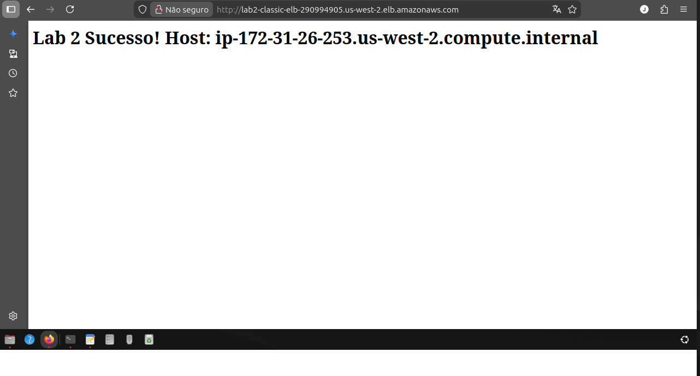
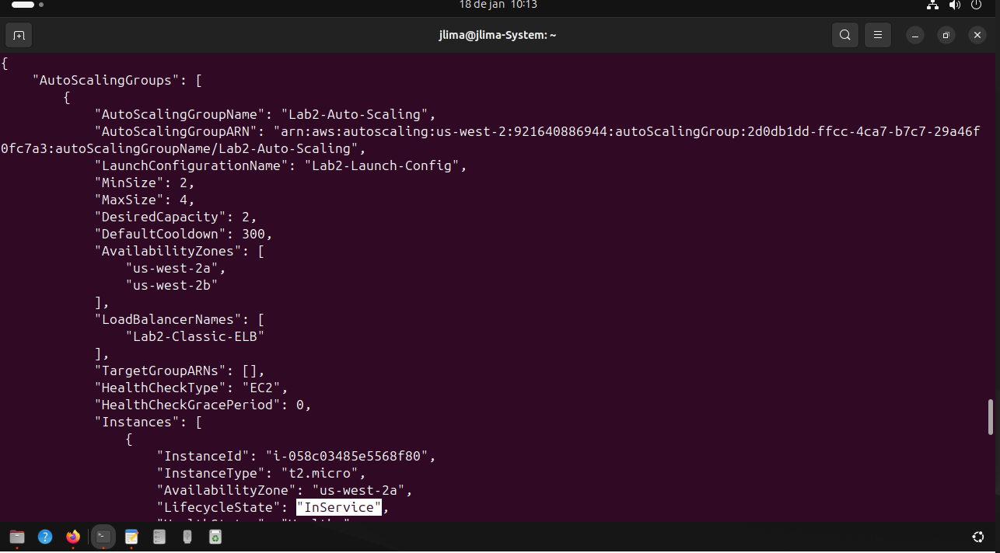

# AWS Lab: Alta Disponibilidade com ELB e Auto Scaling via CLI

Projeto prático de **Cloud Infrastructure** realizado inteiramente via linha de comando (AWS CLI). O objetivo foi criar uma arquitetura web resiliente e escalável.

## 🔨 O que foi feito
- **Classic Load Balancer:** Para distribuir o tráfego entre as instâncias.
- **Auto Scaling Group:** Configurado para manter no mínimo 2 servidores rodando.
- **Self-Healing:** O sistema detecta falhas e substitui instâncias automaticamente.
- **User Data:** Automação da instalação do servidor Apache na inicialização.

## 📸 Evidências

### 1. Load Balancer Funcionando
Teste de acesso via navegador mostrando o balanceamento de carga entre as instâncias.

### 2. Teste de Resiliência (Auto Scaling)
Simulação de falha (terminate) e o Auto Scaling subindo uma nova máquina automaticamente para repor.

---
*Lab de estudos sobre AWS CLI e Infraestrutura Ágil.*
