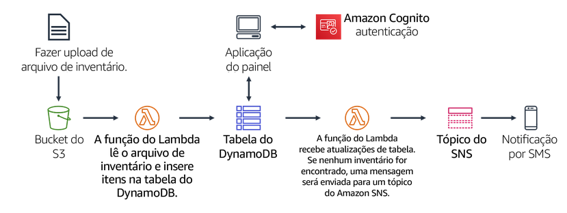
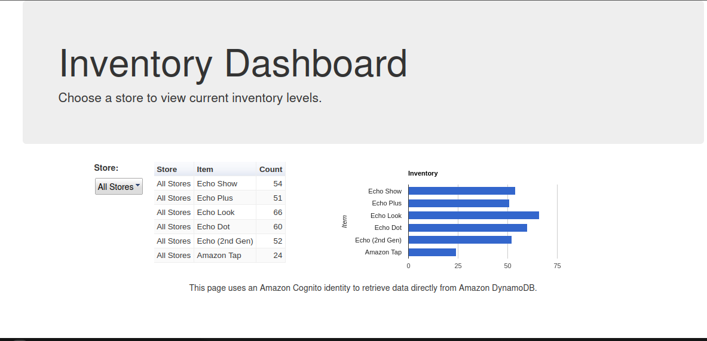
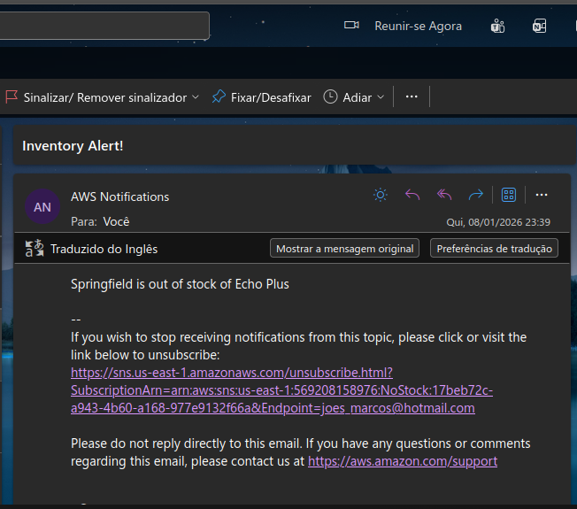

# Serverless Inventory System ☁️📦

## 📋 Visão Geral do Projeto
Implementação de um sistema de Rastreamento de Inventário totalmente **Serverless** (sem servidor) e orientado a eventos na AWS.
O objetivo do projeto foi criar uma arquitetura desacoplada onde o upload de arquivos de carga (CSV) aciona automaticamente o processamento de dados, armazenamento em banco NoSQL e notificações de alerta em tempo real para itens sem estoque.

## 🏗 Arquitetura da Solução
A solução utiliza uma abordagem **Event-Driven**, onde cada serviço reage a uma ação do anterior, garantindo alta escalabilidade e custo reduzido (pay-per-use).

### Fluxo de Dados:
1.  **Ingestão (S3):** Lojas enviam arquivos de inventário (`.csv`) para um Bucket S3.
2.  **Processamento (Lambda - Load):** O evento de criação do objeto no S3 aciona a função `Load-Inventory`.
3.  **Persistência (DynamoDB):** A função lê o CSV e insere os itens na tabela `Inventory` do DynamoDB.
4.  **Visualização:** Um Dashboard Web estático consome os dados do DynamoDB via autenticação Cognito.
5.  **Monitoramento (DynamoDB Streams):** Cada nova inserção no banco aciona a função `Check-Stock`.
6.  **Alerta (SNS):** Se a função detectar `Count = 0` (Sem Estoque), um alerta é publicado no tópico SNS, disparando e-mails para a gerência.

## 🛠 Tecnologias Utilizadas
* **AWS Lambda (Python 3.10):** Lógica de negócio e processamento de dados.
* **Amazon S3:** Armazenamento de objetos e gatilho de eventos.
* **Amazon DynamoDB:** Banco de dados NoSQL para alta performance e baixa latência.
* **Amazon SNS:** Sistema de notificação (Pub/Sub) para alertas via e-mail/SMS.
* **Amazon Cognito:** Autenticação para o dashboard web.
* **Boto3 SDK:** Biblioteca Python para interação com serviços AWS.

## 💻 Detalhes da Implementação

### Função 1: Load Inventory
Responsável por fazer o download do arquivo do S3, fazer o *parse* do CSV e inserir os dados no DynamoDB.
* *Gatilho:* `s3:ObjectCreated:*`

### Função 2: Check Stock Logic
Monitora o fluxo de dados do DynamoDB em tempo real. Separa a lógica de alerta da lógica de carga (Desacoplamento).
* *Gatilho:* `DynamoDB Stream`
* *Lógica:* `if count == 0: sns.publish(...)`

## 📸 Evidências do Projeto

### Painel de Controle (Dashboard)
Visualização dos dados carregados automaticamente após o upload do CSV.

### Automação de Alerta (SNS)
E-mail recebido automaticamente quando um item sem estoque foi detectado.

---
*Projeto desenvolvido durante o programa AWS re/Start Graduate Training - V3 - 2026.*
