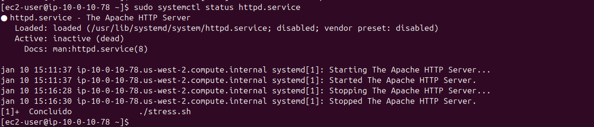
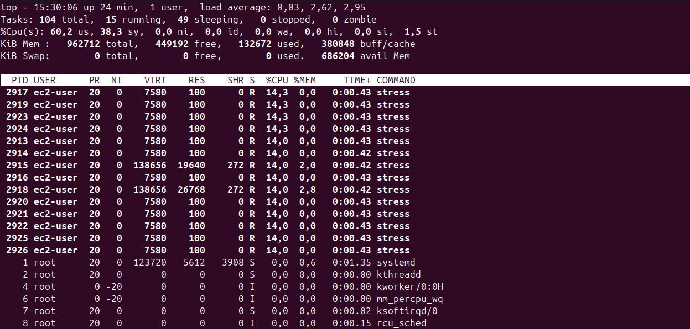
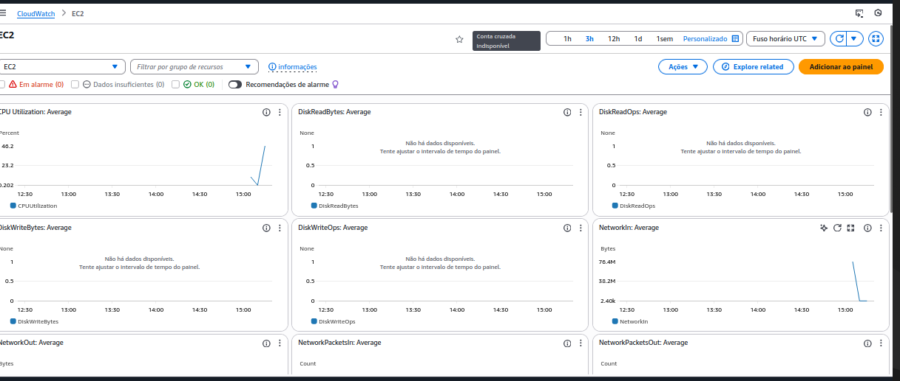

# Lab 09: Gestão de Serviços Web e Monitoramento com CloudWatch 📊☁️

## 📋 Visão Geral
Neste laboratório, explorei o ciclo de vida de serviços no Linux (Apache Web Server) e a integração com ferramentas de monitoramento da AWS.
O objetivo foi configurar um servidor web, simular uma carga alta de processamento (stress test) e analisar o impacto na infraestrutura tanto via terminal quanto via painel gráfico na nuvem.

## 🛠 Atividades Realizadas

### 1. Gestão de Serviços (`systemctl`)
Instalação e controle do servidor web Apache (`httpd`).
* **Comandos:**
    * `sudo systemctl start httpd` (Inicia o serviço)
    * `sudo systemctl status httpd` (Verifica logs e estado)
    * `sudo systemctl stop httpd` (Interrompe o serviço)
* **Resultado:** Servidor web ativo e respondendo na porta 80.

### 2. Monitoramento Local (`top`)
Utilização do utilitário `top` para acompanhar processos em tempo real.
* **Cenário:** Execução de um script de estresse (`stress.sh`) para gerar carga artificial na CPU.
* **Análise:** Identificação imediata do aumento de consumo de recursos (CPU Load) e identificação do processo ofensor.

### 3. Observabilidade na Nuvem (AWS CloudWatch)
Validação das métricas coletadas pela AWS sem acessar o servidor.
* **CloudWatch Metrics:** Visualização do pico de uso da CPU no dashboard do EC2.
* **Conclusão:** O CloudWatch permitiu visualizar o incidente de performance (o teste de estresse) através de gráficos históricos, essencial para post-mortem e alertas.

## 📸 Evidências do Lab

### Serviço Apache Ativo
Validação do `systemctl` mostrando o serviço "Running".

### Teste de Carga (Local)
Comando `top` mostrando o script de estresse consumindo CPU.

### Monitoramento AWS (CloudWatch)
Gráfico do CloudWatch confirmando o pico de processamento no horário do teste.

---
*Lab realizado via AWS Academy - Linux Module.*
