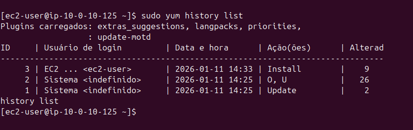
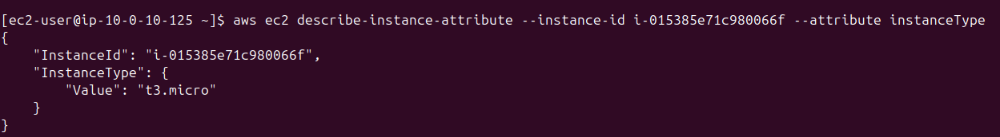

# Lab 10: Gerenciamento de Pacotes, Rollback e AWS CLI 📦☁️

## 📋 Visão Geral
Neste laboratório, avancei para tarefas administrativas críticas no Red Hat Enterprise Linux (RHEL).
O foco foi o gerenciamento seguro de softwares (instalação e atualizações de segurança), estratégias de recuperação (rollback de instalações) e a configuração do ambiente para automação de nuvem via **AWS CLI**.

## 🛠 Atividades Realizadas

### 1. Gerenciamento de Pacotes (`yum`)
Utilização do gerenciador de pacotes YUM para manutenção do sistema.
* **Security Patching:** Execução de `yum update --security` para aplicar apenas correções de vulnerabilidades, mantendo a estabilidade.
* **Instalação:** Deploy do servidor web Apache (`httpd`).

### 2. Estratégia de Rollback (Reversão) 
Simulação de um cenário de falha pós-atualização e recuperação do sistema.
* **Histórico:** Análise de transações passadas com `yum history list`.
* **Undo (Desfazer):** Execução do comando `yum history undo <ID>` para reverter o sistema exatamente ao estado anterior à instalação, removendo o pacote e suas dependências automaticamente.

### 3. Instalação e Configuração da AWS CLI
Configuração da Interface de Linha de Comando da AWS para interação programática com a nuvem.
* **Instalação Manual:** Download via `curl`, descompactação (`unzip`) e instalação do binário.
* **Autenticação:** Configuração de credenciais (`Access Key` e `Secret Key`) no arquivo `~/.aws/credentials`.
* **Teste de API:** Execução do comando `aws ec2 describe-instance-attribute` para validar a conexão autenticada, retornando dados da instância em formato JSON.

## 📸 Evidências do Lab

### Rollback de Pacotes
Demonstração do histórico do YUM após desfazer uma transação (Instalação/Update).

### Integração AWS CLI
Sucesso na comunicação entre o Linux e a API da AWS, retornando o tipo da instância (`t3.micro`).

---
*Lab realizado via AWS Academy - Linux Module.*
