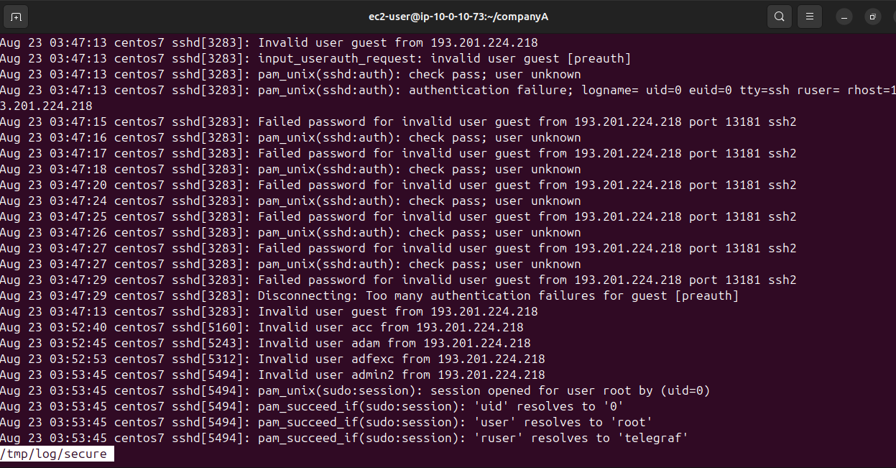
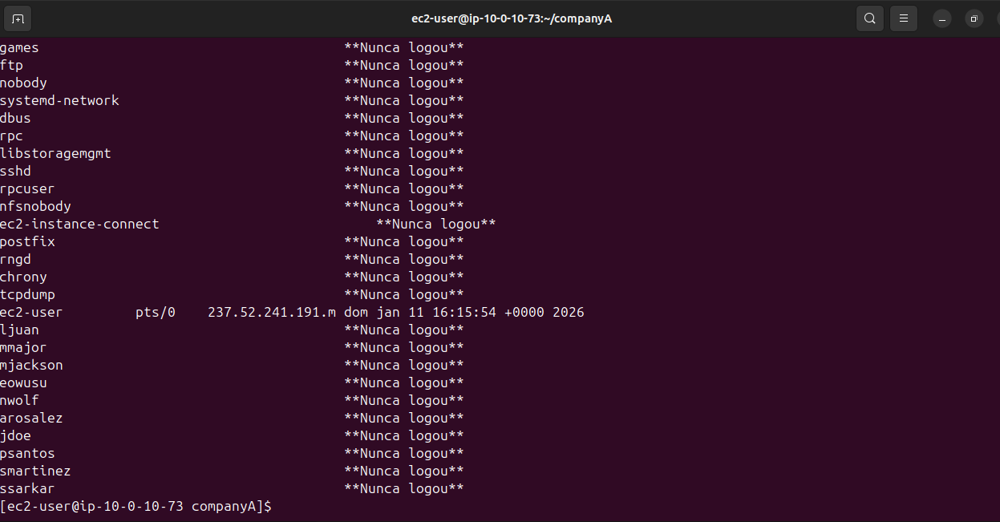

# Lab 11: Auditoria de Segurança e Análise de Logs 🕵️‍♂️🔒

## 📋 Visão Geral
Neste laboratório, o foco mudou de administração para **Segurança da Informação**.
Utilizei ferramentas nativas do Linux para auditar o acesso ao sistema, identificar tentativas de intrusão e revisar o histórico de login de usuários para fins de conformidade e segurança.

## 🛠 Ferramentas e Análises Realizadas

### 1. Análise de Logs de Segurança (`/var/log/secure`)
O Linux registra eventos de autenticação e autorização neste arquivo.
* **Ferramenta:** `sudo less /tmp/log/secure` (Leitura paginada).
* **O que foi analisado:**
    * **Endereços IP de origem:** De onde vêm as conexões.
    * **Tentativas de Falha (Failed Password):** Indicativo de usuários esquecendo senhas ou tentativas de ataque de força bruta.
    * **Uso do Sudo:** Auditoria de quais comandos administrativos foram executados e por quem.

### 2. Auditoria de Logins (`lastlog`)
Verificação do histórico de acesso de todos os usuários do sistema.
* **Comando:** `sudo lastlog`
* **Insights de Negócio Extraídos:**
    * **Contas Inativas:** Identificação de usuários como `bin` ou `daemon` que mostram "**Never logged in**" (Comportamento esperado para contas de serviço).
    * **Último Acesso:** Validação de quando usuários reais acessaram o sistema pela última vez, útil para revogar acessos de ex-funcionários ou detectar acessos fora do horário comercial.

## 📸 Evidências da Auditoria

### Log de Eventos de Segurança
Visualização das tentativas de conexão e falhas de autenticação no arquivo secure.

### Relatório de Último Login
Saída do comando `lastlog` mostrando o status de acesso das contas de usuário.

---
*Lab realizado via AWS Academy - Linux Module.*
